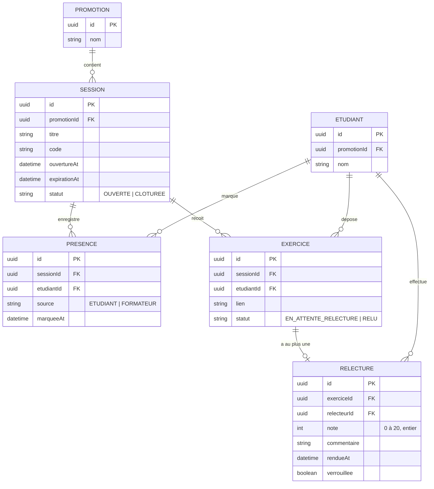

# D2 — Modèle de données

```mermaid
erDiagram
    PROMOTION ||--o{ SESSION : contient
    SESSION ||--o{ PRESENCE : enregistre
    SESSION ||--o{ EXERCICE : recoit
    ETUDIANT ||--o{ PRESENCE : marque
    ETUDIANT ||--o{ EXERCICE : depose
    EXERCICE ||--o| RELECTURE : "a au plus une"
    ETUDIANT ||--o{ RELECTURE : effectue

    PROMOTION {
        uuid id PK
        string nom
    }

    SESSION {
        uuid id PK
        uuid promotionId FK
        string titre
        string code
        datetime ouvertureAt
        datetime expirationAt
        string statut "OUVERTE | CLOTUREE"
    }

    ETUDIANT {
        uuid id PK
        uuid promotionId FK
        string nom
    }

    PRESENCE {
        uuid id PK
        uuid sessionId FK
        uuid etudiantId FK
        string source "ETUDIANT | FORMATEUR"
        datetime marqueeAt
    }

    EXERCICE {
        uuid id PK
        uuid sessionId FK
        uuid etudiantId FK
        string lien
        string statut "EN_ATTENTE_RELECTURE | RELU"
    }

    RELECTURE {
        uuid id PK
        uuid exerciceId FK
        uuid relecteurId FK
        int note "0 à 20, entier"
        string commentaire
        datetime rendueAt
        boolean verrouillee
    }
```