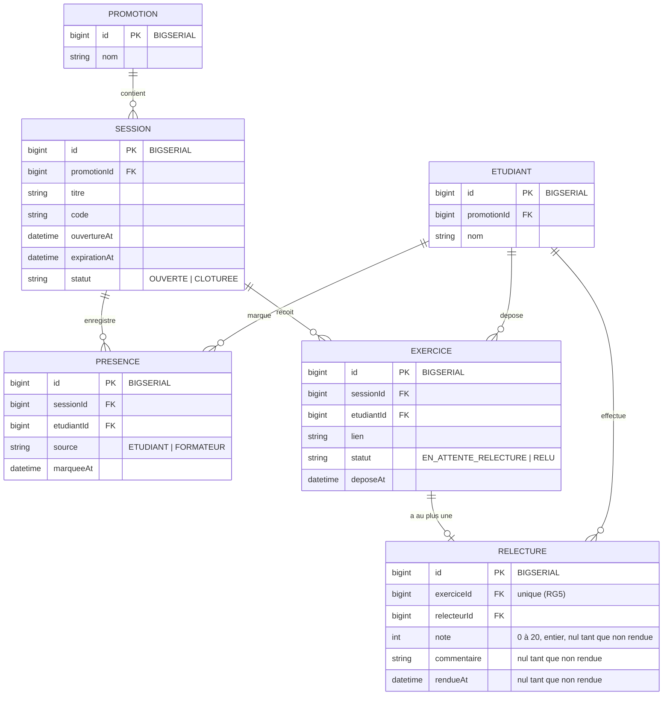

# D2 — Modèle de données

> Mis à jour pendant EF6/EF8 : la relecture est créée **au dépôt** (assignation, EF8),
> d'où note, commentaire et `rendueAt` nuls jusqu'au rendu. Le booléen `verrouillee`
> initialement prévu est retiré : avec RG9, une relecture est verrouillée dès qu'elle
> est rendue, donc `rendueAt non nul` porte déjà l'information — un second champ
> pourrait diverger.

## Identifiants : `bigint` auto-incrément, pas d'UUID

Toutes les clés primaires sont des `bigint` générés par la base (auto-incrément), en cohérence avec le contrat d'API (`api/contrat.yml`) qui impose des identifiants `integer/int64`.

Conséquence concrète sur les migrations Flyway :

- PostgreSQL : `id BIGSERIAL PRIMARY KEY` (ou `bigint GENERATED ALWAYS AS IDENTITY`), jamais `id UUID DEFAULT gen_random_uuid()`.
- Les clés étrangères référencent ces `bigint` : `promotionId BIGINT REFERENCES promotion(id)`, etc.
- H2 (profil de test) : `id BIGINT GENERATED ALWAYS AS IDENTITY PRIMARY KEY`, équivalent sémantique du `BIGSERIAL` PostgreSQL.

Le choix des valeurs d'identifiants appartient donc à la base, jamais au code applicatif : les entités JPA utilisent `GenerationType.IDENTITY` et ne génèrent aucun identifiant côté Java.