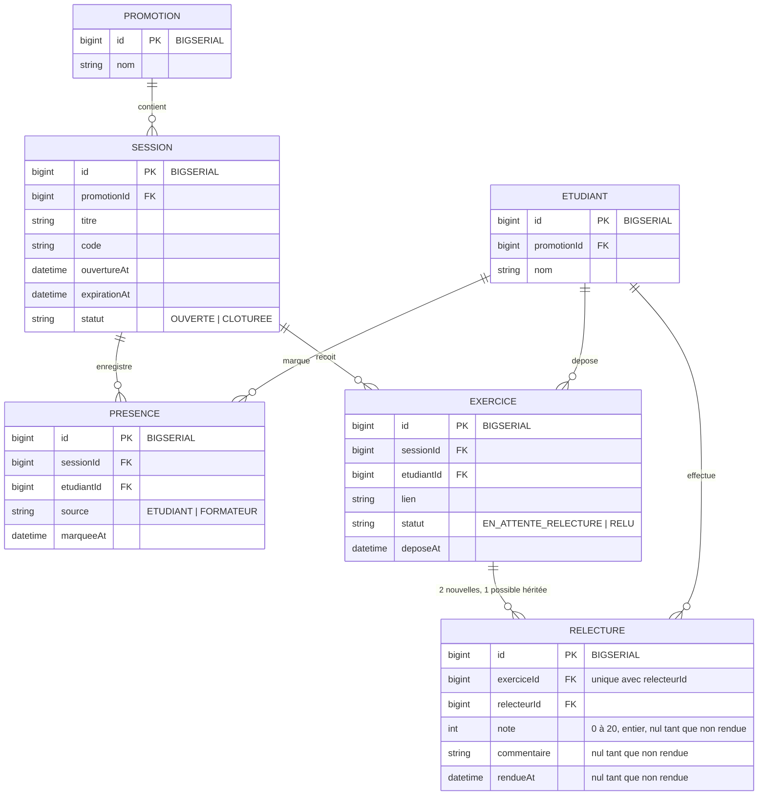

# D2 — Modèle de données

> Décision du ticket #23 : chaque nouveau dépôt crée deux lignes `RELECTURE`, assignées à deux étudiants
> présents différents. La contrainte unique porte sur le couple (`exerciceId`, `relecteurId`), et non
> sur le seul exercice. Chaque ligne garde sa note et son commentaire ; `rendueAt` verrouille ce rendu.
> La migration conserve les lignes historiques et ajoute une seconde affectation lorsqu'un pair
> présent éligible existe. Un exercice historique sans second candidat reste consultable avec sa note
> éventuellement provisoire.

## Identifiants : `bigint` auto-incrément, pas d'UUID

Toutes les clés primaires sont des `bigint` générés par la base (auto-incrément), en cohérence avec le contrat d'API (`api/contrat.yml`) qui impose des identifiants `integer/int64`.

Conséquence concrète sur les migrations Flyway :

- PostgreSQL : `id BIGSERIAL PRIMARY KEY` (ou `bigint GENERATED ALWAYS AS IDENTITY`), jamais `id UUID DEFAULT gen_random_uuid()`.
- Les clés étrangères référencent ces `bigint` : `promotionId BIGINT REFERENCES promotion(id)`, etc.
- H2 (profil de test) : `id BIGINT GENERATED ALWAYS AS IDENTITY PRIMARY KEY`, équivalent sémantique du `BIGSERIAL` PostgreSQL.

Le choix des valeurs d'identifiants appartient donc à la base, jamais au code applicatif : les entités JPA utilisent `GenerationType.IDENTITY` et ne génèrent aucun identifiant côté Java.
