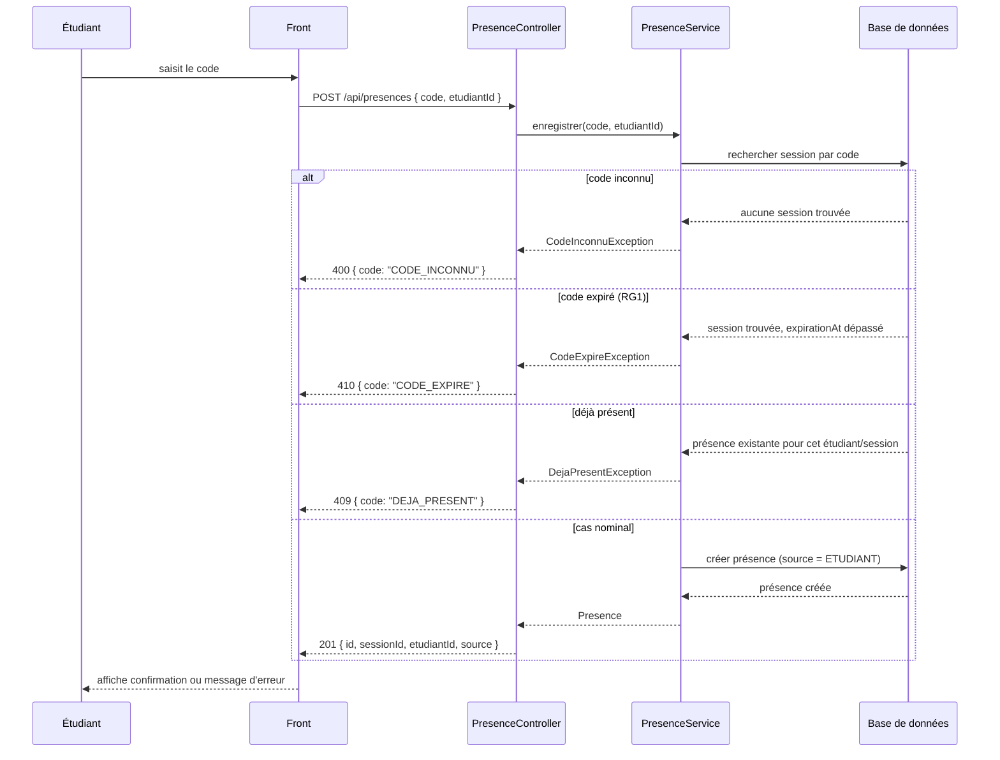

# D3 — Séquence : marquer sa présence

```mermaid
sequenceDiagram
    participant E as Étudiant
    participant F as Front
    participant API as PresenceController
    participant S as PresenceService
    participant DB as Base de données

    E->>F: saisit le code
    F->>API: POST /api/presences { code, etudiantId }
    API->>S: enregistrer(code, etudiantId)
    S->>DB: rechercher session par code

    alt code inconnu
        DB-->>S: aucune session trouvée
        S-->>API: CodeInconnuException
        API-->>F: 400 { code: "CODE_INCONNU" }
    else code expiré (RG1)
        DB-->>S: session trouvée, expirationAt dépassé
        S-->>API: CodeExpireException
        API-->>F: 410 { code: "CODE_EXPIRE" }
    else déjà présent
        DB-->>S: présence existante pour cet étudiant/session
        S-->>API: DejaPresentException
        API-->>F: 409 { code: "DEJA_PRESENT" }
    else cas nominal
        S->>DB: créer présence (source = ETUDIANT)
        DB-->>S: présence créée
        S-->>API: Presence
        API-->>F: 201 { id, sessionId, etudiantId, source }
    end

    F-->>E: affiche confirmation ou message d'erreur
```