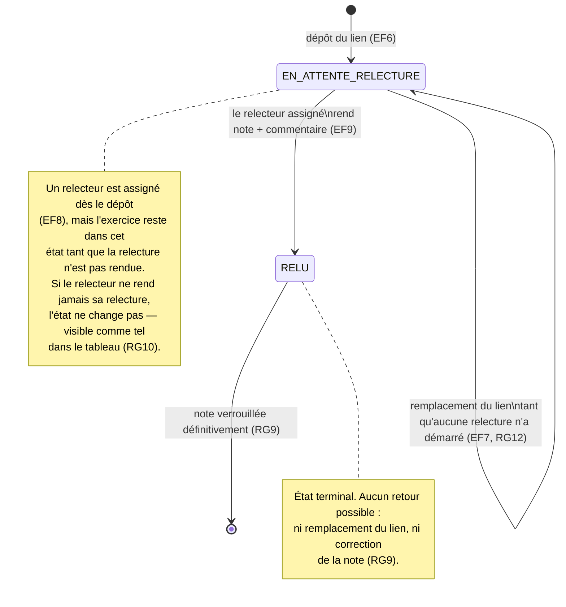

# D4 (Bonus) — États-transitions du cycle de vie d'un exercice

```mermaid
stateDiagram-v2
    [*] --> EN_ATTENTE_RELECTURE : dépôt du lien (EF6)

    EN_ATTENTE_RELECTURE --> EN_ATTENTE_RELECTURE : remplacement du lien\ntant qu'aucune relecture n'a démarré (EF7, RG12)

    EN_ATTENTE_RELECTURE --> RELU : le relecteur assigné\nrend note + commentaire (EF9)

    RELU --> [*] : note verrouillée définitivement (RG9)

    note right of EN_ATTENTE_RELECTURE
        Un relecteur est assigné dès le dépôt
        (EF8), mais l'exercice reste dans cet
        état tant que la relecture n'est pas rendue.
        Si le relecteur ne rend jamais sa relecture,
        l'état ne change pas — visible comme tel
        dans le tableau (RG10).
    end note

    note right of RELU
        État terminal. Aucun retour possible :
        ni remplacement du lien, ni correction
        de la note (RG9).
    end note
```
